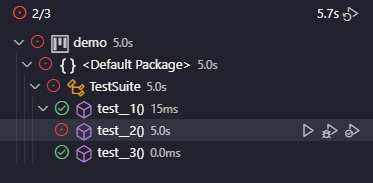

Ir para seção

- [Introdução](#introdução)
- [Instalando o JUnit5](#instalando-o-junit5)
- [Iniciando os testes](#iniciando-os-testes)
- [Annotations](#annotations)
  - [@DisplayName](#displayname)
  - [@Disabled](#disabled)
  - [@Timeout](#timeout)
  - [@RepeatedTest](#repeatedtest)
  - [@ParameterizedTest](#parameterizedtest)

# Introdução

## Pré-requisitos

- VS Code
- Extension Pack for Java (extensão do VS Code)
- Maven for Java (extensão do VS Code já inclusa no Extension Pack for Java)

## Criando projeto com Maven

1. No VS Code, abra o Command Palette com <kbd>Ctrl + Shift + P</kbd>
1. Na Command Palette, escreva **> Java: Create Java Project** e pressione <kbd>Enter</kbd>
1. Selecione: **Maven** e pressione <kbd>Enter</kbd>
1. Selecione: **No Archetype** e pressione <kbd>Enter</kbd>
1. Personalize o **id** do projeto e pressione <kbd>Enter</kbd>
1. Personalize o **artifact** do seu projeto e pressione <kbd>Enter</kbd>
1. A extensão Java do VS Code gerará uma estrutura como essa:

```plain
├───src
│   ├───main
│   │   ├───java
│   │   │   └───com
│   │   │       └───example
│   │   └───resources
│   └───test
│       └───java
├───target
└───pom.xml
...
```

# Instalando o JUnit5

## Editando o pom.xml

Para instalar o JUnit5, abra o arquivo **pom.xml** e adicione à tag **dependencies** a dependência do JUnit5 usando a tag **dependency**. O arquivo deve se parecer com isso ao final:

```xml
<?xml version="1.0" encoding="UTF-8"?>
<project
  xmlns="http://maven.apache.org/POM/4.0.0"
  xmlns:xsi="http://www.w3.org/2001/XMLSchema-instance"
  xsi:schemaLocation="http://maven.apache.org/POM/4.0.0 http://maven.apache.org/xsd/maven-4.0.0.xsd"
>
  <modelVersion>4.0.0</modelVersion>

  <groupId>com.example</groupId>
  <artifactId>demo</artifactId>
  <version>1.0-SNAPSHOT</version>

  <properties>
    <maven.compiler.source>17</maven.compiler.source>
    <maven.compiler.target>17</maven.compiler.target>
  </properties>

  <dependencies>
    <dependency>
      <groupId>org.junit.vintage</groupId>
      <artifactId>junit-vintage-engine</artifactId>
      <version>5.9.1</version>
      <scope>test</scope>
    </dependency>
  </dependencies>
</project>

```

## Instalando as dependências

Logo após editar o **pom.xml**, execute este comando no terminal para instalar as dependências. Feito isso, já podemos usar o JUnit5 para iniciar os testes.

```bash
mvn clean install
```

# Iniciando os testes

## Estrutura básica de uma classe de testes

### Decorator @Test e assertEquals

Quando testamos algo com JUnit5, utilizamos uma variedade de **decorators** para configurar a nossa classe de testes ou os nossos métodos de testes. Abaixo, temos dois métodos que usam o decorator **Test** que define que o método da classe é um método de teste. É em um método como esse que testaremos alguma funcionalidade do programa.

Para sabermos que um teste deve passar, comparamos sempre uma coisa com outra. Um determinado valor deve de alguma forma ser igual a outro valor ou representar algo relativo a ele. No caso abaixo, usamos **assertEquals** que é o método mais simples de Assertion. Este método vai verificar se um valor é igual ao outro.

Nos métodos de teste abaixo, é visível que os testes certamente passarão, pois o número 1 é igual a ele mesmo.

```java
import static org.junit.jupiter.api.Assertions.assertEquals;

import org.junit.jupiter.api.*;

public class TestSuite {
	@Test
	public void test__1() {
		assertEquals(1, 1);
	}

	@Test
	public void test__2() {
		assertEquals(1, 1);
	}
}
```

### Rodando os testes

Para rodar os testes, é muito simples. Basta rodar no terminal o comando abaixo.

```bash
mvn test
```

O resultado dos nossos testes no terminal deve ser algo como isso:

```plain
[INFO] -------------------------------------------------------
[INFO]  T E S T S
[INFO] -------------------------------------------------------
[INFO] Running TestSuite
[INFO] Tests run: 2, Failures: 0, Errors: 0, Skipped: 0, Time elapsed: 0.034 s -- in TestSuite
[INFO]
[INFO] Results:
[INFO]
[INFO] Tests run: 2, Failures: 0, Errors: 0, Skipped: 0
[INFO]
[INFO] ------------------------------------------------------------------------
[INFO] BUILD SUCCESS
[INFO] ------------------------------------------------------------------------
[INFO] Total time:  1.358 s
[INFO] Finished at: 2025-05-08T10:20:01-03:00
[INFO] ------------------------------------------------------------------------
```

### BeforeAll e AfterAll

Os decorators **BeforeAll** e **AfterAll** definem que um método da classe de testes será executado antes ou depois de todos os testes da classe. Perceba que estes métodos são estáticos, diferentemente dos métodos de testes e outros que veremos posteriormente. Isso acontece por um motivo que veremos posteriormente.

```java
import static org.junit.jupiter.api.Assertions.assertEquals;

import org.junit.jupiter.api.*;

public class TestSuite {
	@BeforeAll
	public static void setup() {
		System.out.println("Running setup before all tests");
	}

	@AfterAll
	public static void teardown() {
		System.out.println("Running teardown before all tests");
	}

	// ...
}
```

Para demonstrar melhor a ordem de execução, modificamos os métodos de teste para exibir algo no terminal quando forem chamados. E o resultado foi este. Perceba que o método marcado com @BeforeAll de fato foi chamado apenas uma vez antes de todos os testes. Logo depois, todos os testes foram executados e apenas depois de tudo isso o método marcado com @AfterAll foi chamado. Podemos dizer que a ordem é algo como isso:

1. BeforeAll
1. Test
1. Test
1. AfterAll

```plain
Running setup before all tests
Test 1
Test 2
Running teardown before all tests
```

Outros decorators são **BeforeEach** e **AfterEach**. Pelo nome, já podemos presumir que eles definem que um método será chamado antes ou depois de cada teste. Adicionamos um terceiro teste para a exibição ficar melhor.

```java
import static org.junit.jupiter.api.Assertions.assertEquals;

import org.junit.jupiter.api.*;

public class TestSuite {
	// ...

	@BeforeEach
	public void before() {
		System.out.println("Running something before each test");
	}

	@AfterEach
	public void after() {
		System.out.println("Running something after each test");
	}

	// ...
}
```

Agora, o resultado destas exibições no console fica dessa forma. E a ordem fica assim:

1. BeforeAll
1. Before Each
1. Test
1. After Each
1. Before Each
1. Test
1. After Each
1. Before Each
1. Test
1. After Each
1. AfterAll

```plain
Running setup before all tests
Running something before each test
Test 1
Running something after each test
Running something before each test
Test 2
Running something after each test
Running something before each test
Test 3
Running something after each test
Running teardown before all tests
```

A estrutura geral de uma classe de testes é similar ao que apresentamos. Abaixo, a classe completa:

```java
import static org.junit.jupiter.api.Assertions.assertEquals;

import org.junit.jupiter.api.*;

public class TestSuite {
	@BeforeAll
	public static void setup() {
		System.out.println("Running setup before all tests");
	}

	@AfterAll
	public static void teardown() {
		System.out.println("Running teardown before all tests");
	}

	@BeforeEach
	public void before() {
		System.out.println("Running something before each test");
	}

	@AfterEach
	public void after() {
		System.out.println("Running something after each test");
	}

	@Test
	public void test__1() {
		System.out.println("Test 1");
		assertEquals(1, 1);
	}

	@Test
	public void test__2() {
		System.out.println("Test 2");
		assertEquals(1, 1);
	}

	@Test
	public void test__3() {
		System.out.println("Test 3");
		assertEquals(1, 1);
	}
}
```

# Annotations

| Annotation    | Descrição                                                                                                                                            |
| ------------- | ---------------------------------------------------------------------------------------------------------------------------------------------------- |
| @Test         | Marca um método de uma classe como um método de teste                                                                                                |
| @BeforeAll    | Marca um método de uma classe para ser executado antes de todos os métodos de testes de uma classe                                                   |
| @AfterAll     | Marca um método de uma classe para ser executado depois de todos os métodos de testes de uma classe                                                  |
| @BeforeEach   | Marca um método de uma classe para ser executado antes de cada método de teste de uma classe                                                         |
| @AfterEach    | Marca um método de uma classe para ser executado depois de cada método de teste de uma classe                                                        |
| @DisplayName  | Define um nome ou título para uma classe ou método de teste                                                                                          |
| @Disabled     | Marca uma classe ou método de teste como desabilitada para que não seja executado/a durante os testes                                                |
| @Timeout      | Define um tempo limite que um método de testes ou um métodos marcados com BeforeAll, AfterAll, BeforeEach e AfterEach pode tomar para ser completado |
| @RepeatedTest | Define que um teste será executado repetidamente por uma quantidade customizável de vezes                                                            |
| @ParameterizedTest | Define que um teste será executado repetidamente por uma quantidade customizável de vezes                                                            |

## @DisplayName

Para demonstrar esta Annotation, definimos um nome para a classe de testes e para cada método de teste da classe, exceto o último

```java
import static org.junit.jupiter.api.Assertions.assertEquals;

import org.junit.jupiter.api.*;

@DisplayName("My only test suite")
public class TestSuite {
	@Test
	@DisplayName("Test number #1")
	public void test__1() {
		assertEquals(1, 1);
	}

	@Test
	@DisplayName("Test number #2")
	public void test__2() {
		assertEquals(1, 1);
	}

	@Test
	public void test__3() {
		assertEquals(1, 1);
	}
}
```

Por padrão, o JUnit5 não é permitido a exibir DisplayName quando rodamos os testes pelo terminal. Portanto, agora acessamos o item **Testing** do menu lateral que tem o ícone de um Erlenmeyer (item para experimentos). Nessa aba, temos alguns botões na parte superior. Para rodar os testes, apertamos no primeiro dos botões que tiver o ícone de **Play**. Este terá como legenda algo como "Run Tests".

O resultado que visualizamos é o seguinte. E como podemos ver, ao lado da classe de testes, é exibido o nome que definimos para ela. Assim como nos métodos. Exceto pelo último método para o qual não definimos um nome. Este exibe apenas o tempo que o teste tomou para completar.


## @Disabled

Agora, marcamos o primeiro método de teste da classe como desabilitado.

```java
import static org.junit.jupiter.api.Assertions.assertEquals;

import org.junit.jupiter.api.*;

public class TestSuite {
	@Test
	@Disabled
	public void test__1() {
		assertEquals(1, 1);
	}

	@Test
	public void test__2() {
		assertEquals(1, 1);
	}

	@Test
	public void test__3() {
		assertEquals(1, 1);
	}
}
```

E abaixo, o resultado. Perceba que foram executados apenas dois testes e o primeiro teste está com ícone de que foi ignorado.


## @Timeout

Para demonstrarmos essa Annotation, modificamos o segundo método de teste para esperar no máximo 5 segundos. Porém, nele temos um delay de 10 segundos para fazermos que o teste falhe por timeout.

```java
import static org.junit.jupiter.api.Assertions.assertEquals;

import java.util.concurrent.TimeUnit;

import org.junit.jupiter.api.*;

public class TestSuite {
	@Test
	public void test__1() {
		assertEquals(1, 1);
	}

	@Test
	@Timeout(5)
	public void test__2() {
		try {
			TimeUnit.SECONDS.sleep(10);
		} catch (Exception e) {
			// TODO: handle exception
		}
	}

	@Test
	public void test__3() {
		assertEquals(1, 1);
	}
}
```

Nesta sessão de testes, o segundo teste falhou. Como esperávamos, o teste falhou por ter demorado mais de 5 segundos para concluir.



O @Timeout também pode ser usado como abaixo. Isso nos permite usar outras unidades de tempo para timeout. Neste caso, estamos delimitando um timeout de 5 milissegundos para o método de teste ser executado.
```java
import static org.junit.jupiter.api.Assertions.assertEquals;

import java.util.concurrent.TimeUnit;

import org.junit.jupiter.api.*;

public class TestSuite {
	@Test
	public void test__1() {
		assertEquals(1, 1);
	}

	@Test
	@Timeout(value = 5, unit = TimeUnit.MILLISECONDS)
	public void test__2() {
		assertEquals(1, 1);
	}

	@Test
	public void test__3() {
		assertEquals(1, 1);
	}
}
```

## @RepeatedTest
Agora, definimos que o primeiro método de teste será executado três vezes.
```java
import static org.junit.jupiter.api.Assertions.assertEquals;

import org.junit.jupiter.api.*;

public class TestSuite {
	@Test
	@RepeatedTest(3)
	public void test__1() {
		assertEquals(1, 1);
	}

	@Test
	public void test__2() {
		assertEquals(1, 1);
	}

	@Test
	public void test__3() {
		assertEquals(1, 1);
	}
}
```

O resultado abaixo demonstra que de fato, o primeiro teste foi executado três vezes.


Também é permitido usar esta Annotation como abaixo. Dessa forma, definimos uma forma de exibir os nomes de cada repetição do teste. Temos as variáveis **displayName** (nome do método de teste caso ele tenha), **currentRepitition** (repetição atual) e **totalRepititions** (total de repetições) para customizar o nome. 
```java
import static org.junit.jupiter.api.Assertions.assertEquals;

import org.junit.jupiter.api.*;

public class TestSuite {
	@Test
	@DisplayName("My named test method")
	@RepeatedTest(value = 3, name = "{displayName} {currentRepetition}/{totalRepetitions}")
	public void test__1() {
		assertEquals(1, 1);
	}

	@Test
	public void test__2() {
		assertEquals(1, 1);
	}

	@Test
	public void test__3() {
		assertEquals(1, 1);
	}
}
```

Como esperado, os nomes das repetições estão como customizamos.


## @ParameterizedTest